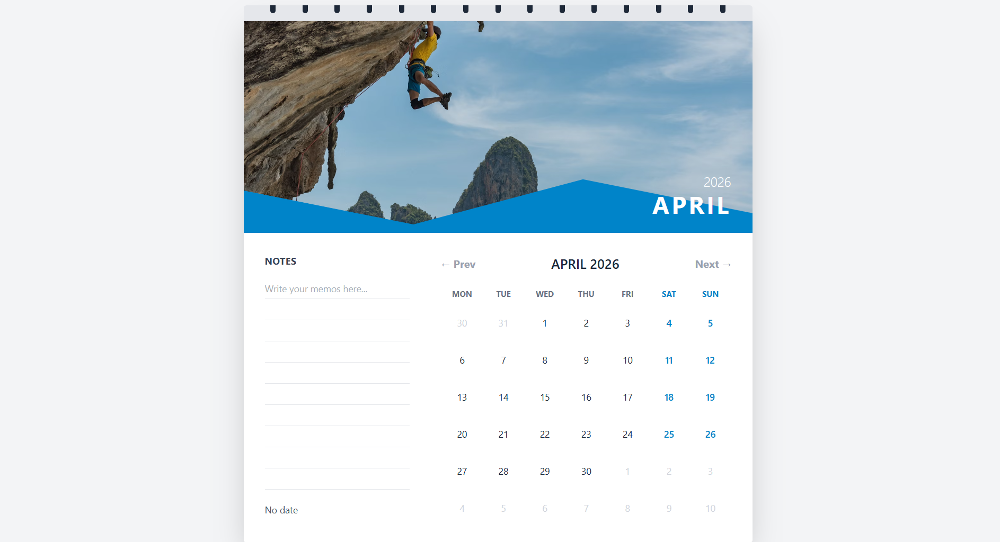

# 📅 Wall Calendar (React)

A modern, responsive **wall calendar UI** built with React. This project allows users to select date ranges, add notes, and enjoy smooth animated transitions .

---

## 🚀 Features

* 📆 Date range selection (start & end date)
* 📝 Notes with localStorage persistence
* 🎨 Clean and modern UI (Tailwind CSS)
* ⚡ Smooth animations using Framer Motion
* 📱 Fully responsive design

---

## 🛠️ Tech Stack

* React.js
* Tailwind CSS
* JavaScript (ES6+)

---

## 📂 Project Structure

```
/src
 ├── components
 │    └── WallCalendar.jsx
 |    └── HeroSection.jsx
 |    └── Notes.jsx
 ├── App.jsx
 └── index.html
```

---

## ⚙️ Installation & Setup

1. Clone the repository:

```bash
git clone https://github.com/subham-oss/Wall_Calendar
```

2. Install dependencies:

```bash
npm install
```

3. Run the development server:

```bash
npm run dev
```

---

## 📸 Screenshots

 <p align="center">
  
</p>

---

## 💡 Future Improvements

* Month navigation (next/previous)
* Multiple notes per date
* Drag-to-select date range

---

## 🤝 Contributing

Contributions are welcome! Feel free to fork this repo and submit a pull request.

---


## 👨‍💻 Author

**Subham**

* GitHub: [https://github.com/subham-oss](https://github.com/subham-oss)

---

⭐ If you like this project, give it a star!
